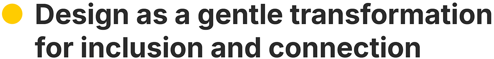

　

Hi! I'm Evelyn. Welcome to 🍵 **Maccha Koubou / 抹茶工房** – the workshop of gentle ideas and warm designs!

From digital services to physical spaces, I believe design can connect technology, society, and people. Through thoughtful, empathetic practice, I aim to respond to complex and systemic challenges with inclusion and connection.

　

#### My Design Focus

- 🏳️‍🌈 **Queer & Feminism** - I focus on how vulnerability is unequally distributed through intersectional power structures, and work towards fostering practices of mutual care and connection.

- ♿️ **Anti-Ableism** - I see disability as shaped by social and systemic barriers, and focus on accessible and enabling design for people with diverse access needs.

　

#### My Skills

- 🎨 **Graphic Design**: Illustrator, Figma, Photoshop, InDesign, After Effects, Data visualization, Hand sketch

- ✨ **3D Design**: V-Ray, Rhino, SketchUp

- 💻 **Programming**: Kotlin, React, C#, Processing, Arduino, Git

- 🌍 **Languages**: Mandarin (Native), English (B2), Japanese (B1), Dutch (A2)

